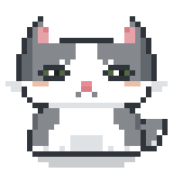
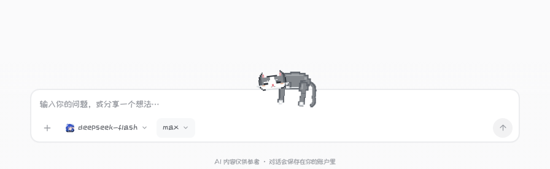

# 乐乐 · 角色原型与动画设计交接

这份文件供其他 AI 和动画设计者复用乐乐形象。按用户要求，它独立于 `AI协作.md`；项目规范、待办和发布记录仍只写在 `AI协作.md`。本文记录角色与动画接口，不另建协作记录。

## 1. 先认清是哪只猫

乐乐是 OOAPI 里的灰白像素小猫。用户的实拍猫是动作和毛色参考，现有的像素脸是产品角色原型。**可以为动作绘制侧卧身体、关节、背面和必要遮挡，但不要重新设计脸、加眉毛或替换成另一只猫。**



- 灰毛覆盖头部两侧、背部、尾巴和腿的大部分；白色集中在鼻梁、嘴周、胸腹和爪尖。
- 淡橙色只在脸颊小面积出现，不能把背、腿和尾巴画成橙猫。
- 绿灰色眼睛，小粉鼻、粉耳内；眼睛已有睁眼、闭眼、开心弧线三套形状。它们是互斥的眼形，不是新增眉毛。
- 保留耳形、两侧脸部灰斑、中央白色鼻梁、胡须与像素轮廓。动画中头和五官一起动。
- 尾巴细长，粗细应明显小于后腿大腿。新侧卧姿态尾巴最宽约 3.5 个 SVG 单位；末端允许弯曲，不画成粗毛柱。
- 新侧卧腿部的白色仅在末端约 3–4 个 SVG 单位；不要把整段前臂/小腿涂白。
- 描边使用已有的深灰，不加一圈粗黑边。肢体转动后，描边不能变成手边突出的黑条。

| 用途 | 颜色 |
| --- | --- |
| 原型最深轮廓、眼线 | `#30343b` |
| 毛色阴影、新身体外沿 | `#62676e` |
| 主要灰毛 | `#85898e` |
| 侧卧背部高光 | `#a2a6aa` |
| 白毛阴影、胡须 | `#dfe2e5` |
| 白毛 | `#ffffff` |
| 耳内、鼻子 | `#e5a2a8` / `#ea8a94` / `#d97d86` |
| 局部淡橙脸颊 | `#e6b090`，透明度 `0.8` |
| 眼睛 | `#526842` / `#1c221e` |

## 2. 当前侧卧动作的身体关系

这是侧卧，不是坐姿。身体横向压在输入框上沿；当前画面头在左、髋部在右。照片朝向与之相反时，应按身体部位镜像理解。

**外侧的一条前腿从肩部垂下，外侧的一条后腿从髋部垂下。** 两腿沿躯干前后分开。另一只前爪折在胸前、位于边沿上方；远侧后腿被侧卧身体遮住。尾巴从臀部后方落下。

绝不能画成“两条前腿挂在胸下，后腿却保持蹲坐”。也不能把头、腿、尾巴剪成几个不相连的片段。照片中的身体关系优先于套用现有坐姿素材。



[打开可重播的侧卧动画预览](output/lele-drape-preview.html)。预览内可分别播放入场、文字靠近后的惊醒、自然醒后离场；画面使用实际 SVG 与 CSS。

| 部位 | SVG 分组 | 关节 / 边界（SVG 坐标） |
| --- | --- | --- |
| 原有头与五官 | `.cat-cranium` | 原头型，枢轴 `(16,19)`；睡时平移 `(0,8)` 并轻倾 `-7°` |
| 横向躯干 | `.lounge-body` | 下缘 `y=28` 贴住输入框上沿，呼吸从 `(35,28)` 伸缩 |
| 近侧前腿 | `.lounge-front-leg` | 肩 `(25,24)`；下段 `.lounge-wrist` 从 `(25,30)` 弯曲 |
| 近侧后腿 | `.lounge-hind-leg` | 髋 `(44,23)`；下段 `.lounge-hock` 从 `(44,33)` 弯曲 |
| 远侧前爪 | `.lounge-folded-paw` | 收在胸前，枢轴 `(30,24)`；不是又一条后腿 |
| 尾巴 | `.lounge-tail` | 尾根 `(48,22)`，从髋部后方自然垂下 |

身体上的关节必须跟随身体运动；起跳要有收腿、落脚和后腿发力。起跳后小腿向腹部折回，不能把整条直腿直接旋转到头顶。

## 3. 侧卧动作的完整时间线

| 阶段 | 时长 | 动作与触发 |
| --- | --- | --- |
| `enter` | 1.9 秒 | 从框后上来，先支撑身体，再放下前腿、后腿与尾巴；约 52% 后才让悬垂部位越过边沿 |
| `rest` | 本轮总等待 28–40 秒 | 侧卧闭眼，轻微呼吸；前后腿错开节奏，尾尖轻摆。普通随机换位不能打断这段 |
| `startle` | 1.6 秒 | 实际文字接近悬垂部位、摸到头/躯干，或发送/复制等操作时触发；抬头睁眼、竖尾、伸腿，随后收腿落脚、压身起跳、藏到框后 |
| `stretch` | 3.4 秒 | 到期未受打扰：慢慢抬头、弓背伸展、收回悬腿、站起迈步，再跳到框后 |
| `hidden` | 等下轮调度 | 离场后隐藏身体；不是透明度渐隐的离场动画 |

惊醒的关键帧：0% 睡姿；12–24% 抬头、竖尾和肢体反射；34% 压低身体并收腿；40% 开始只显示边沿上方；54% 离地、肘与后腿关节折回；100% 整只猫已经在框后。遮挡开始前必须确认爪子、尾巴已越过边沿，不能通过突然改变层级切掉身体。

自然离场的关键帧：22% 起身；42% 前伸、弓背；62% 双脚落回边沿；70–83% 前后交替迈步；89% 收腿跳下。向左跑动的距离根据当前位置限制，不能跑出窄屏。

## 4. 输入框是实体

- 普通原型 `viewBox="0 0 32 32"`；侧卧拓展为 `0 0 64 54`，脸的原始坐标不变。
- 侧卧显示尺寸 `112 × 94.5px`，比例为 `1.75`。SVG 的 `y=28` 对齐输入框外沿，只有悬垂腿和尾巴可以落到框前。
- 遮挡由 `.lele-edge-viewport` 的 `clip-path` 控制。悬垂可见时下缘为 0；起跳回框后时下缘为 `45.5px`。不在飞行中突然切 `z-index`。
- 输入碰撞使用真正的 textarea 排版：复制字体、字距、内边距、换行、滚动偏移，使用 `Range.getClientRects()` 测可见文字，再与 `[data-drape-contact]` 三个部位相交判断，提前量 `7px`。
- 空输入、远处短句、尾巴下方但尚未触碰的文字，不应惊醒。中文输入法、长文本粘贴、换行和输入框增高也走同一套测量。
- 悬垂爪子和尾巴不拦截输入框点击；只有框上方的头/躯干可触发 hover 反应。
- 随机侧卧位置在框宽的 34%–66% 之间，兼顾 320px 窄屏。按减少动画设置隐藏悬垂装饰。
- 询问出现后，现有确认姿态与气泡固定位置，直到确认结束；不要让随机动作或 hover 带走确认按钮。询问由 `ComposerCompanion` 接管，不在动作 CSS 中自行启动。

## 5. 源码地图与接口

| 文件 | 负责什么 |
| --- | --- |
| [ChatMascot.jsx](ooapi-web/src/components/ChatMascot.jsx) | 原型 SVG、五官、独立肢体、侧卧 `DrapedBody`、胶囊道具 |
| [ComposerCompanion.jsx](ooapi-web/src/components/ComposerCompanion.jsx) | 随机动作、阶段调度、边沿几何、菜单落点、输入碰撞、询问锁定 |
| [lele-drape.css](ooapi-web/src/components/lele-drape.css) | 本次侧卧、惊醒、伸展离场的所有部位关键帧与遮挡 |
| [composerTextCollision.js](ooapi-web/src/components/composerTextCollision.js) | textarea 可见文字与悬垂肢体的实际位置测量 |
| [composer-companion.css](ooapi-web/src/components/composer-companion.css) | 普通边沿动作、侧边/底部片段、询问气泡 |
| [lele-locomotion.css](ooapi-web/src/components/lele-locomotion.css) | 转身、菜单起跳、菜单间转移、掉落与落地 |
| [chat-workspace.css](ooapi-web/src/components/chat-workspace.css) | 基础乐乐状态、执行胶囊、动作颜色和工具道具 |
| [PromptBar.jsx](ooapi-web/src/components/PromptBar.jsx) | 传入实际文本、textarea 引用和菜单开关 |
| [lele-drape-smoke.mjs](ooapi-server/tests/lele-drape-smoke.mjs) | 在真实页面调度动作、输入/粘贴、分帧截图、窄屏和减少动画验证 |

```jsx
<ChatMascot state="idle" gesture="drape" />
// 仅渲染 SVG。完整框沿动作还需要 ComposerCompanion 的外层结构与样式：
// .lele-perch-anchor.at-top.pose-drape.phase-rest
//   > .lele-edge-viewport > .lele-edge-actor > .chat-mascot

<ComposerCompanion
  state={mascotState}
  inputValue={value}
  inputRef={textareaRef}
  menuOpen={menuOpen}
  approvals={approvals}
  onDecide={onApproval}
/>

// 用户操作事件：typing / send / copy / retry / attach
window.dispatchEvent(new CustomEvent("lele-action", { detail: { action: "copy" } }));
```

`state` 表达对话状态；`gesture` 表达动作，二者不要混为一个随意替换的图。普通状态含 `idle`、`thinking`、`working`、`waiting`、`attentive`、`success`、`sad`、`asking`、`compressing`、`loading`。使用这些状态时应检查通用 CSS 是否会覆盖新动作的眼睛或动画。

## 6. 现有动作入口

以下是当前代码的动作名称，供扩展时对接，不代表每一种都已经达到实拍动作的精细程度。做新设计时应提供身体分部位的运动，不只是把现有 SVG 整张转动。

| 场景 | `gesture` |
| --- | --- |
| 上沿随机动作 | `pop`、`walk`、`spin`、`toy`、`belly`、`cute`、`lick`、`groom`、`wash`、`stretch`、`wink`、`curl`、`sleep`、`zzz`、`peek`、`wave`、`paws`、`look`、`chase`、`knead`、`shake`、`shy`、`drape` |
| 侧边局部探出 | `side-peek`、`side-scout`、`side-paw`、`side-tap` |
| 底边局部露出 | `tail-slip`、`tail-tip`、`feet-kick`、`foot-dangle` |
| 询问/操作反应 | `curious`、`listen`、`invite`、`shy`、`proud` |
| 菜单移动 | `leap`、`transfer`、`drop` |
| 执行胶囊道具 | `capsule-think`、`capsule-wave`、`capsule-notebook`、`capsule-inspect`、`capsule-search`、`capsule-key`、`capsule-chart`、`capsule-coin`、`capsule-read`、`capsule-type`、`capsule-reach`、`capsule-list`、`capsule-pack` |

普通换位间隔为 12–24 秒。侧边动作应有转头探出的过程；底部只有尾巴或后腿片段，不把整只猫倒放。菜单从模型框切到推理框时，落点按新框实际高度重新测量；关闭菜单时从当前可见位置落下。所有这些行为必须保留。

## 7. 给其他 AI 的设计要求（可直接复制）

> 基于这份文件中的现有乐乐 SVG 设计动画，保留原来的像素脸、耳形、灰白毛区、绿色眼睛与淡橙脸颊，不加眉毛，不重做 IP。把输入框当作实体边沿。每个动作先画清楚肩、髋、前后腿与尾根，再设计准备、运动、缓冲、收势；各关节独立运动，尾巴有跟随和延迟。侧卧时只有近侧前腿与近侧后腿垂下，远侧前爪收胸前，远侧后腿被身体遮挡；不要画成两只前爪垂下、后腿蹲坐。给出入场、循环、受惊中断与自然离场的完整分镜和可执行 SVG/CSS。转身要有侧身与背面，掉落要有身体失衡、抓空、四肢调整和落地缓冲，不用整图旋转或感叹号代替。视觉检查至少展示原尺寸、放大姿态以及关键帧，并验证框沿遮挡、菜单切换、询问锁定与窄屏。不要引入新依赖。

接收这份文件时，最好同时附上用户给出的实拍猫照片，让动作设计者核对真实关节与毛色。仓库不包含私人实拍照片。

## 8. 原型代码快照

下面附上当前角色组件与侧卧动作样式的完整快照，方便只发送这一份 Markdown 时复用。后续实现以第 5 节链接的源文件为准；修改原型后应同步更新本节。

<!-- LELE_SOURCE_SNAPSHOT -->

### ChatMascot.jsx

```jsx
import React, { useEffect, useState } from "react";
export default function ChatMascot({ state = "idle", gesture = "" }) {
  const airborne = ["leap", "transfer", "drop"].includes(gesture);
  const turning = ["chase", "spin"].includes(gesture);
  const draped = gesture === "drape";
  const [visible, setVisible] = useState(!document.hidden);
  useEffect(() => { const change = () => setVisible(!document.hidden); document.addEventListener("visibilitychange", change); return () => document.removeEventListener("visibilitychange", change); }, []);
  return <span className={`chat-mascot is-${state} ${gesture ? `gesture-${gesture}` : ""}`} data-motion={visible ? "on" : "off"} aria-hidden="true">
{["thinking", "working", "compressing", "loading"].includes(state) && <span className="lele-sparks"><i/><i/><i/></span>}
<span className="lele-sleep" aria-hidden="true">z<span>Z</span><b>Z</b></span>
{state === "asking" && <span className="lele-question-mark">?</span>}
{["toy", "proud"].includes(gesture) && <span className="lele-heart" aria-hidden="true">♥</span>}
{gesture === "toy" && <span className="lele-toy" aria-hidden="true"/>}
{gesture.startsWith("capsule-") && <CapsuleAccessory kind={gesture.slice(8)}/>}
<svg xmlns="http://www.w3.org/2000/svg" viewBox={draped ? "0 0 64 54" : "0 0 32 32"} width={draped ? "112" : "64"} height={draped ? "94.5" : "64"} aria-hidden="true" shapeRendering="crispEdges">

  <g className="cat-shadow" fill="#30343b" opacity="0.25">
    <rect x="7" y="29" width="18" height="1" />
    <rect x="9" y="30" width="14" height="1" />
  </g>


  <g className="cat-tail">

    <path fill="#30343b" d="
      M26,22 h2 v1 h-2 z
      M25,23 h1 v2 h-1 z
      M26,24 h1 v1 h-1 z
      M27,24 h1 v3 h-1 z
      M30,22 h1 v3 h-1 z
      M29,25 h1 v2 h-1 z
      M27,27 h2 v1 h-2 z
    " />

    <rect x="27" y="22" width="3" height="2" fill="#85898e" />
    <rect x="26" y="23" width="1" height="1" fill="#85898e" />
    <rect x="27" y="24" width="2" height="3" fill="#85898e" />
    <rect x="28" y="26" width="1" height="1" fill="#dfe2e5" />
  </g>


  <g className="cat-body">

    <path fill="#30343b" d="
      M7,20 h1 v1 h-1 z
      M6,21 h1 v3 h-1 z
      M5,24 h1 v4 h-1 z
      M6,28 h2 v1 h-2 z
      M24,20 h1 v1 h-1 z
      M25,21 h1 v3 h-1 z
      M26,24 h1 v4 h-1 z
      M24,28 h2 v1 h-2 z
    " />

    <rect x="8" y="20" width="3" height="1" fill="#85898e" />
    <rect x="7" y="21" width="4" height="3" fill="#85898e" />
    <rect x="6" y="24" width="3" height="3" fill="#85898e" />
    <rect x="6" y="21" width="1" height="3" fill="#62676e" />
    <rect x="21" y="20" width="3" height="1" fill="#85898e" />
    <rect x="21" y="21" width="4" height="3" fill="#85898e" />
    <rect x="23" y="24" width="3" height="3" fill="#85898e" />
    <rect x="25" y="21" width="1" height="3" fill="#62676e" />

    <rect x="11" y="20" width="10" height="4" fill="#ffffff" />
    <rect x="10" y="23" width="12" height="2" fill="#ffffff" />
    <rect x="9" y="24" width="14" height="2" fill="#ffffff" />

    <rect x="13" y="25" width="6" height="3" fill="#dfe2e5" />
    <rect x="12" y="28" width="8" height="1" fill="#30343b" />
  </g>


  {airborne && <g className="cat-hindlegs" fill="#85898e" stroke="#62676e" strokeWidth=".6">
    <g className="cat-hind-left"><path d="M7 22h4v5H7z"/><path fill="#fff" d="M6 26h5v3H6z"/></g>
    <g className="cat-hind-right"><path d="M21 22h4v5h-4z"/><path fill="#fff" d="M21 26h5v3h-5z"/></g>
  </g>}
  {draped && <DrapedBody/>}
  <g className="cat-cranium">
  <g className="cat-head">

    <path fill="#30343b" d="
      M7,3 h1 v1 h-1 z
      M6,4 h1 v1 h-1 z
      M5,5 h1 v2 h-1 z
      M4,7 h1 v3 h-1 z
      M3,10 h1 v6 h-1 z
      M4,16 h1 v2 h-1 z
      M5,18 h1 v1 h-1 z
      M6,19 h3 v1 h-3 z
      M24,3 h1 v1 h-1 z
      M25,4 h1 v1 h-1 z
      M26,5 h1 v2 h-1 z
      M27,7 h1 v3 h-1 z
      M28,10 h1 v6 h-1 z
      M27,16 h1 v2 h-1 z
      M26,18 h1 v1 h-1 z
      M23,19 h3 v1 h-3 z
      M11,7 h10 v1 h-10 z
    " />


    <rect x="7" y="5" width="2" height="3" fill="#e5a2a8" />
    <rect x="8" y="5" width="1" height="1" fill="#d97d86" />
    <rect x="23" y="5" width="2" height="3" fill="#e5a2a8" />
    <rect x="23" y="5" width="1" height="1" fill="#d97d86" />


    <rect x="7" y="4" width="1" height="1" fill="#85898e" />
    <rect x="6" y="5" width="1" height="3" fill="#85898e" />
    <rect x="5" y="7" width="1" height="3" fill="#62676e" />
    <rect x="6" y="8" width="5" height="4" fill="#85898e" />
    <rect x="4" y="10" width="2" height="5" fill="#62676e" />
    <rect x="6" y="12" width="2" height="3" fill="#85898e" />
    <rect x="11" y="8" width="3" height="3" fill="#85898e" />
    <rect x="12" y="11" width="1" height="1" fill="#85898e" />

    <rect x="24" y="4" width="1" height="1" fill="#85898e" />
    <rect x="25" y="5" width="1" height="3" fill="#85898e" />
    <rect x="26" y="7" width="1" height="3" fill="#62676e" />
    <rect x="21" y="8" width="5" height="4" fill="#85898e" />
    <rect x="26" y="10" width="2" height="5" fill="#62676e" />
    <rect x="24" y="12" width="2" height="3" fill="#85898e" />
    <rect x="18" y="8" width="3" height="3" fill="#85898e" />
    <rect x="19" y="11" width="1" height="1" fill="#85898e" />


    <rect x="14" y="8" width="4" height="4" fill="#ffffff" />
    <rect x="13" y="12" width="6" height="3" fill="#ffffff" />
    <rect x="8" y="15" width="16" height="2" fill="#ffffff" />
    <rect x="5" y="15" width="3" height="2" fill="#ffffff" />
    <rect x="24" y="15" width="3" height="2" fill="#ffffff" />
    <rect x="5" y="17" width="22" height="1" fill="#ffffff" />
    <rect x="6" y="18" width="20" height="1" fill="#ffffff" />

    <rect x="9" y="19" width="14" height="1" fill="#dfe2e5" />
  </g>


  <g className="cat-face">
    <path className="cat-happy-eyes" fill="none" stroke="#30343b" strokeWidth="1.5" d="M8 14l2-2 2 2m8 0 2-2 2 2"/>
    <path className="cat-sleep-eyes" fill="none" stroke="#30343b" strokeWidth="1.5" d="M8 14h4m8 0h4"/>

    <g className="cat-eyes">

      <path fill="#30343b" d="M8,12 h4 v1 h-4 z M7,13 h1 v1 h-1 z M12,13 h1 v1 h-1 z M8,14 h4 v1 h-4 z" />
      <rect x="8" y="13" width="4" height="1" fill="#526842" />
      <rect x="9" y="13" width="1" height="1" fill="#ffffff" />
      <rect x="10" y="13" width="1" height="1" fill="#1c221e" />


      <path fill="#30343b" d="M20,12 h4 v1 h-4 z M19,13 h1 v1 h-1 z M24,13 h1 v1 h-1 z M20,14 h4 v1 h-4 z" />
      <rect x="20" y="13" width="4" height="1" fill="#526842" />
      <rect x="21" y="13" width="1" height="1" fill="#ffffff" />
      <rect x="22" y="13" width="1" height="1" fill="#1c221e" />
    </g>


    <g className="cat-cheeks" fill="#e6b090" opacity="0.8"><rect x="6" y="15" width="3" height="1"/><rect x="23" y="15" width="3" height="1"/></g>
    <g className="cat-nose-mouth">

      <rect x="15" y="15" width="2" height="1" fill="#ea8a94" />
      <rect x="15" y="16" width="2" height="1" fill="#d97d86" />

      <rect x="14" y="17" width="1" height="1" fill="#85898e" />
      <rect x="17" y="17" width="1" height="1" fill="#85898e" />
    </g>


    <g className="cat-whiskers" fill="#dfe2e5">
      <rect x="1" y="15" width="3" height="1" />
      <rect x="2" y="16" width="2" height="1" />
      <rect x="28" y="15" width="3" height="1" />
      <rect x="28" y="16" width="2" height="1" />
    </g>
  </g>
  {turning && <g className="cat-head-back">
    {/* 转到背面时沿用原头型和灰白毛区，脸留在前面，不翻到后脑勺。 */}
    <path fill="#62676e" d="M7 3h1v4h16V3h1v2h2v5h2v6h-1v2h-2v2H6v-2H4v-2H3v-6h2V5h2z"/>
    <path fill="#85898e" d="M7 5h1v4h16V5h1v5h2v6h-2v2H7v-2H5v-6h2z"/>
    <path fill="#dfe2e5" d="M12 8h8v4h-1v3h4v3H9v-3h4v-3h-1z"/>
    <path fill="#fff" d="M9 17h14v2H9z"/>
  </g>}
  </g>
  <g className="cat-paws">

    <g className="cat-paw-left">
    {(airborne || ["feet-kick", "foot-dangle"].includes(gesture)) && <g className="cat-leg-reach"><path fill="#62676e" d="M9 16h4v10H9z M8 25h1v3H8z M9 28h4v1H9z M13 25h1v3h-1z"/><path fill="#85898e" d="M10 16h3v8h-3z"/><path fill="#dfe2e5" d="M10 23h3v3h-3z"/></g>}
    <rect x="9" y="25" width="4" height="3" fill="#ffffff" />
    <rect x="8" y="27" width="1" height="2" fill="#dfe2e5" />
    <rect className="cat-paw-ground" x="8" y="28" width="5" height="1" fill="#30343b" />
    <rect x="11" y="27" width="1" height="1" fill="#dfe2e5" />

    </g>
    <g className="cat-paw-right">
    {(airborne || ["feet-kick", "foot-dangle", "side-paw", "side-tap"].includes(gesture)) && <g className="cat-leg-reach"><path fill="#62676e" d="M19 16h4v10h-4z M18 25h1v3h-1z M19 28h4v1h-4z M23 25h1v3h-1z"/><path fill="#85898e" d="M19 16h3v8h-3z"/><path fill="#dfe2e5" d="M19 23h3v3h-3z"/></g>}
    <rect x="19" y="25" width="4" height="3" fill="#ffffff" />
    <rect x="23" y="27" width="1" height="2" fill="#dfe2e5" />
    <rect className="cat-paw-ground" x="19" y="28" width="5" height="1" fill="#30343b" />
    <rect x="20" y="27" width="1" height="1" fill="#dfe2e5" />

    </g>
    <rect x="6" y="27" width="2" height="1" fill="#ffffff" />
    <rect x="24" y="27" width="2" height="1" fill="#ffffff" />
  </g>


</svg>

  </span>;
}

// 同一只乐乐的侧卧肢体：沿用灰白毛区和原脸，肩、肘、髋、尾根独立活动。
// y=28 是输入框边沿；只有放松的小腿和尾端可以越过这条边。
function DrapedBody() {
  return <g className="cat-lounge-rig">
    <g className="lounge-tail" data-drape-contact="tail">
      <path fill="none" stroke="#62676e" strokeWidth="3.5" strokeLinecap="round" d="M48 22C55 22 55 28 54 33S56 40 52 43"/>
      <path fill="none" stroke="#85898e" strokeWidth="2" strokeLinecap="round" d="M48 22C54 23 54 28 53.5 33S55 39 52 42.5"/>
    </g>
    <g className="lounge-body">
      <path fill="#62676e" d="M20 18h2v-3h4v-2h6v-1h9v1h5v2h3v3h2v5h-1v2h-3v2h-7v1H23v-1h-4v-3h-1v-4h2z"/>
      <path fill="#85898e" d="M21 18h2v-2h4v-2h6v-1h7v1h5v2h3v3h2v4h-2v2h-3v1h-6v1H24v-1h-4v-3h-1v-2h2z"/>
      <path fill="#a2a6aa" d="M28 15h5v-1h7v1h4v1H28z M45 17h2v2h-2z"/>
      <path fill="#62676e" d="M41 20h5v1h-2v2h-2v2h-2v-3h1z"/>
      <path fill="#dfe2e5" d="M22 24h5v1h5v1h8v1H24v-1h-3v-1h1z"/>
    </g>
    <g className="lounge-folded-paw">
      <path fill="#62676e" d="M29 21h4v5h-2v2h-6v-3h4z"/>
      <path fill="#85898e" d="M30 22h2v3h-3v1h-2v-1h3z"/>
      <path fill="#dfe2e5" d="M26 25h5v2h-5z"/>
      <path fill="#fff" d="M27 25h3v1h-3z"/>
    </g>
    {/* 照片中垂下的是近侧前腿和近侧后腿，分别从肩、髋伸出；远侧后腿被侧卧躯干遮住。 */}
    <g className="lounge-hanging-leg lounge-hind-leg" style={{"--joint-x":"44px","--joint-y":"23px"}} data-drape-contact="hind-leg">
      <path fill="#62676e" d="M41 21h7v3h1v5h-2v5h-5v-4h-2v-5h1z"/>
      <path fill="#85898e" d="M42 22h5v3h1v3h-2v5h-3v-4h-2v-3h1z"/>
      <path fill="#a2a6aa" d="M42 23h2v5h-2z"/>
      <g className="lounge-hock">
        <path fill="#62676e" d="M42 31h5v5h-1v6h-1v2h-4v-1h-1v-4h1v-5h1z"/>
        <path fill="#85898e" d="M43 32h3v3h-1v6h-3v-2h-1v-3h1v-3h1z"/>
        <path fill="#dfe2e5" d="M41 40h4v3h-4z"/>
        <path fill="#fff" d="M42 40h2v2h-2z"/>
      </g>
    </g>
    <g className="lounge-hanging-leg lounge-front-leg" style={{"--joint-x":"25px","--joint-y":"24px"}} data-drape-contact="front-leg">
      <path fill="#62676e" d="M22 22h6v5h-1v5h-5v-3h-1v-4h1z"/>
      <path fill="#85898e" d="M23 22h4v5h-1v4h-3v-3h-1v-3h1z"/>
      <g className="lounge-wrist">
        <path fill="#62676e" d="M22 29h5v5h-1v6h-1v1h-4v-1h-1v-3h1v-8z"/>
        <path fill="#85898e" d="M23 29h3v5h-1v5h-3v-3h1z"/>
        <path fill="#dfe2e5" d="M21 38h4v3h-1v1h-3z"/>
        <path fill="#fff" d="M22 39h2v2h-2z"/>
      </g>
    </g>
  </g>;
}

// 工作道具独立于乐乐原来的像素身体；完成后的姿势由各方法分别定格。
function CapsuleAccessory({ kind }) {
  const shapes = {
    think:<path d="M4 3v3M1 5h6M7 0v2M6 1h2"/>,
    wave:<path d="M1 2q4 0 4 4M2 0q5 1 5 5"/>,
    notebook:<><path d="M1 1h6v7H1zM3 1v7M4 3h2M4 5h2"/></>,
    inspect:<><circle cx="3" cy="3" r="2.5"/><path d="m5 5 3 3M3 2v2"/></>,
    search:<><circle cx="3" cy="3" r="2.5"/><path d="m5 5 3 3M2 3h2M3 2v2"/></>,
    key:<><circle cx="2.5" cy="2.5" r="2"/><path d="m4 4 4 4M6 6l1-1"/></>,
    chart:<path d="M1 1v7h7M3 6V4M5 6V2M7 6V1"/>,
    coin:<><circle cx="4" cy="4" r="3.5"/><path d="M4 2v4"/></>,
    read:<path d="M4 2Q2 0 0 1v6q2-1 4 1 2-2 4-1V1Q6 0 4 2v6"/>,
    type:<path d="M1 0h6v5H1zM0 7h8M2 7v1M6 7v1"/>,
    reach:<path d="M4 0v8M0 4h8M1 1l6 6M1 7l6-6"/>,
    list:<path d="M0 1h1M3 1h5M0 4h1M3 4h5M0 7h1M3 7h5"/>,
    pack:<path d="m0 2 4-2 4 2v5L4 9 0 7V2l4 2 4-2M4 4v5"/>,
  };
  return <svg className={`capsule-accessory accessory-${kind}`} viewBox="-1 -1 11 11" aria-hidden="true" fill="none" stroke="currentColor" strokeWidth="1.2" strokeLinecap="round" strokeLinejoin="round">{shapes[kind] || shapes.wave}</svg>;
}
```

### lele-drape.css

```css
/* 112 / 64 = 1.75；SVG y=28 与边沿重合，余下 26 行是悬在前面的腿和尾巴。 */
.lele-perch-anchor.pose-drape {z-index:4;}
.pose-drape .lele-edge-viewport {left:-27px;bottom:-45.5px;width:112px;height:158px;overflow:visible;contain:none;clip-path:inset(-140px -100px 0px -100px);}
.pose-drape .lele-edge-actor {left:0;bottom:0;width:112px;height:94.5px;transform:none;--rest-y:0px;--rest-angle:0deg;transform-origin:50% 49px;pointer-events:none;}
.pose-drape :is(.cat-cranium,.lounge-body) {pointer-events:visiblePainted;}
.pose-drape .lele-edge-actor>.chat-mascot {width:112px;height:94.5px;}
.pose-drape .chat-mascot>svg {width:112px;height:94.5px;overflow:visible;}
.pose-drape :is(.cat-tail,.cat-body,.cat-paws,.cat-shadow,.lele-sparks,.lele-sleep,.cat-happy-eyes) {display:none!important;}
.pose-drape .cat-cranium {transform:translate(0px,8px) rotate(-7deg);transform-origin:16px 19px;animation:none;}
.pose-drape .cat-eyes {display:none;animation:none;transform-origin:center;}
.pose-drape .cat-sleep-eyes {display:block;}
.pose-drape .lounge-body {transform-origin:35px 28px;animation:lele-drape-breathe 4.8s ease-in-out infinite;}
.pose-drape .lounge-tail {transform-origin:48px 22px;animation:lele-drape-tail 6s ease-in-out infinite;}
.pose-drape .lounge-hanging-leg {transform-origin:var(--joint-x) var(--joint-y);}
.pose-drape .lounge-front-leg {animation:lele-drape-paw 5.7s ease-in-out infinite;}
.pose-drape .lounge-hind-leg {animation:lele-drape-paw 6.5s -2s ease-in-out infinite reverse;}
.pose-drape .lounge-wrist {transform-origin:25px 30px;}
.pose-drape .lounge-hock {transform-origin:44px 33px;}
.pose-drape .lounge-folded-paw {transform-origin:30px 24px;}
.pose-drape.phase-enter .lele-edge-actor {animation:lele-drape-arrive 1.9s ease-in-out both;}
.pose-drape.phase-enter .lele-edge-viewport {animation:lele-drape-uncover 1.9s steps(1) both;}
.pose-drape.phase-enter .cat-cranium {animation:lele-drape-settle-head 1.9s ease-in-out both;}
.pose-drape.phase-enter .lounge-hanging-leg {animation:lele-drape-unfold 1.9s ease-in-out both;}
.pose-drape.phase-enter .lounge-tail {animation:lele-drape-uncoil 1.9s ease-in-out both;}
.pose-drape.phase-startle .lele-edge-actor {animation:lele-drape-hop-hide 1.6s linear both;}
.pose-drape.phase-startle .lele-edge-viewport {animation:lele-drape-cover 1.6s steps(1) both;}
.pose-drape.phase-startle .cat-cranium {animation:lele-drape-startled-head 1.6s linear both;}
.pose-drape.phase-startle .cat-eyes {display:block;animation:lele-drape-wide-eyes 1.6s linear both;}
.pose-drape.phase-startle .cat-sleep-eyes {display:none;}
.pose-drape.phase-startle .lounge-body {animation:lele-drape-startled-body 1.6s linear both;}
.pose-drape.phase-startle .lounge-tail {animation:lele-drape-tail-up 1.6s linear both;}
.pose-drape.phase-startle .lounge-front-leg {animation:lele-drape-fling-near 1.6s linear both;}
.pose-drape.phase-startle .lounge-hind-leg {animation:lele-drape-fling-far 1.6s linear both;}
.pose-drape.phase-startle .lounge-wrist {animation:lele-drape-fold-wrist 1.6s linear both;}
.pose-drape.phase-startle .lounge-hock {animation:lele-drape-fold-hock 1.6s linear both;}
.pose-drape.phase-startle .lounge-folded-paw {animation:lele-drape-kick 1.6s linear both;}
.pose-drape.phase-stretch .lele-edge-actor {animation:lele-drape-stretch-run 3.4s linear both;}
.pose-drape.phase-stretch .lele-edge-viewport {animation:lele-drape-run-cover 3.4s steps(1) both;}
.pose-drape.phase-stretch .cat-cranium {animation:lele-drape-yawn-head 3.4s ease-in-out both;}
.pose-drape.phase-stretch .lounge-body {animation:lele-drape-back-stretch 3.4s ease-in-out both;}
.pose-drape.phase-stretch .lounge-tail {animation:lele-drape-rise-tail 3.4s ease-in-out both;}
.pose-drape.phase-stretch .lounge-front-leg {animation:lele-drape-step-near 3.4s linear both;}
.pose-drape.phase-stretch .lounge-hind-leg {animation:lele-drape-step-far 3.4s linear both;}
.pose-drape.phase-stretch .lounge-wrist {animation:lele-drape-wrist-step 3.4s linear both;}
.pose-drape.phase-stretch .lounge-hock {animation:lele-drape-hock-step 3.4s linear both;}
.pose-drape.phase-stretch .lounge-folded-paw {animation:lele-drape-hind-step 3.4s linear both;}
.pose-drape.phase-stretch .cat-eyes {display:block;animation:lele-drape-drowsy-eyes 3.4s linear both;}
.pose-drape.phase-stretch .cat-sleep-eyes {display:none;}
.pose-drape.phase-hidden .lele-edge-actor {visibility:hidden;pointer-events:none;animation:none;transform:translateY(120px);}

@keyframes lele-drape-breathe {0%,100%{transform:scaleY(1)}50%{transform:scaleY(1.035)}}
@keyframes lele-drape-tail {0%,100%{transform:rotate(0)}45%{transform:rotate(3deg)}75%{transform:rotate(-2deg)}}
@keyframes lele-drape-paw {0%,100%{transform:rotate(0)}50%{transform:rotate(3deg)}}
@keyframes lele-drape-arrive {0%{transform:translate(-16px,104px)}30%{transform:translate(-8px,-6px)}52%{transform:translate(0,-3px)}75%,100%{transform:none}}
@keyframes lele-drape-uncover {0%{clip-path:inset(-140px -100px 45.5px -100px)}52%,100%{clip-path:inset(-140px -100px 0px -100px)}}
@keyframes lele-drape-settle-head {0%{transform:translate(0,1px) rotate(4deg)}60%,100%{transform:translate(0,8px) rotate(-7deg)}}
@keyframes lele-drape-unfold {0%,52%{transform:translateY(-3px) rotate(-105deg)}86%{transform:rotate(7deg)}100%{transform:none}}
@keyframes lele-drape-uncoil {0%,52%{transform:rotate(145deg)}86%{transform:rotate(-8deg)}100%{transform:none}}
/* 抬起悬垂部位后才启用边沿遮挡，此时轮廓已经在边线上方，不靠切层级藏身体。 */
@keyframes lele-drape-cover {0%{clip-path:inset(-140px -100px 0px -100px)}40%,100%{clip-path:inset(-140px -100px 45.5px -100px)}}
@keyframes lele-drape-hop-hide {0%,24%{transform:none}34%{transform:translateY(2px)}54%{transform:translate(8px,-42px);animation-timing-function:cubic-bezier(.5,0,.85,.4)}100%{transform:translate(26px,132px)}}
@keyframes lele-drape-startled-head {0%{transform:translate(0,8px) rotate(-7deg)}10%,24%{transform:translate(-2px,-2px) rotate(8deg)}34%{transform:translate(0,5px) rotate(-3deg)}54%{transform:translate(2px,-2px) rotate(-10deg)}100%{transform:translate(3px,1px) rotate(-4deg)}}
@keyframes lele-drape-wide-eyes {0%{transform:scaleY(.2)}10%,54%{transform:scale(1.05,1.6)}100%{transform:none}}
@keyframes lele-drape-startled-body {0%{transform:none}12%,24%{transform:scale(.95,1.13)}34%{transform:scale(1.08,.75)}54%{transform:scale(.86,1.04)}100%{transform:scale(.85,.8)}}
@keyframes lele-drape-tail-up {0%{transform:none}12%,28%{transform:rotate(172deg)}40%{transform:rotate(158deg)}58%{transform:rotate(120deg)}100%{transform:rotate(145deg)}}
@keyframes lele-drape-fling-near {0%{transform:none}12%,24%{transform:rotate(60deg)}34%{transform:translate(0,-6px) scaleY(.55)}54%,100%{transform:translate(0,-4px) rotate(35deg)}}
@keyframes lele-drape-fling-far {0%{transform:none}12%,24%{transform:rotate(-62deg)}34%{transform:translate(0,-6px) scaleY(.52)}54%,100%{transform:translate(-3px,-5px) rotate(-55deg)}}
/* 起跳后肘/跗关节反向弯曲，把小腿收向腹部，不能把整条腿硬转到头顶。 */
@keyframes lele-drape-fold-wrist {0%{transform:none}12%,24%{transform:rotate(25deg)}34%{transform:none}54%,100%{transform:rotate(-140deg)}}
@keyframes lele-drape-fold-hock {0%{transform:none}12%,24%{transform:rotate(-10deg)}34%{transform:none}54%,100%{transform:rotate(140deg)}}
@keyframes lele-drape-kick {0%{transform:none}12%,24%{transform:translate(-4px,-3px) rotate(30deg)}34%{transform:translateY(-1px)}54%,100%{transform:translate(-2px,-3px) rotate(15deg)}}
@keyframes lele-drape-run-cover {0%{clip-path:inset(-140px -100px 0px -100px)}68%,100%{clip-path:inset(-140px -100px 45.5px -100px)}}
@keyframes lele-drape-stretch-run {0%,60%{transform:none}70%{transform:translate(calc(var(--drape-run-x) * .1),-3px)}77%{transform:translate(calc(var(--drape-run-x) * .3),0)}83%{transform:translate(calc(var(--drape-run-x) * .6),-5px)}89%{transform:translate(calc(var(--drape-run-x) * .85),-22px);animation-timing-function:cubic-bezier(.55,0,.85,.5)}100%{transform:translate(var(--drape-run-x),130px)}}
@keyframes lele-drape-yawn-head {0%{transform:translate(0,8px) rotate(-7deg)}22%{transform:translate(-1px,3px) rotate(-2deg)}42%{transform:translate(-3px,7px) rotate(-9deg)}62%{transform:translate(1px,-2px) rotate(5deg)}100%{transform:translate(2px,-2px) rotate(7deg)}}
@keyframes lele-drape-back-stretch {0%{transform:none}22%{transform:scaleY(1.2)}42%{transform:translate(2px,-3px) scale(1.12,1.3)}62%{transform:translateY(-7px)}75%{transform:translateY(-6px) scale(.95,1.1)}83%,100%{transform:translateY(-7px) scale(1.1,.9)}}
@keyframes lele-drape-rise-tail {0%{transform:none}22%{transform:rotate(30deg)}42%{transform:rotate(136deg)}62%{transform:rotate(158deg)}77%{transform:rotate(110deg)}89%,100%{transform:rotate(140deg)}}
@keyframes lele-drape-step-near {0%{transform:none}22%{transform:rotate(72deg)}42%{transform:translate(-4px,-1px) rotate(68deg) scaleY(.85)}62%{transform:translateY(-7px) rotate(5deg) scaleY(.6)}70%{transform:translate(-2px,-8px) rotate(12deg) scaleY(.6)}77%{transform:translate(1px,-7px) rotate(-10deg) scaleY(.6)}83%{transform:translate(-2px,-9px) rotate(20deg) scaleY(.6)}89%,100%{transform:translateY(-4px) rotate(35deg)}}
@keyframes lele-drape-step-far {0%{transform:none}22%{transform:rotate(-35deg)}42%{transform:translateY(-6px) rotate(-12deg) scaleY(.6)}62%{transform:translateY(-7px) rotate(-5deg) scaleY(.6)}70%{transform:translate(1px,-7px) rotate(-10deg) scaleY(.6)}77%{transform:translate(-2px,-9px) rotate(15deg) scaleY(.6)}83%{transform:translate(1px,-7px) rotate(-12deg) scaleY(.6)}89%,100%{transform:translate(-3px,-5px) rotate(-55deg)}}
@keyframes lele-drape-wrist-step {0%,22%{transform:none}42%{transform:rotate(-12deg)}62%{transform:none}70%{transform:rotate(-18deg)}77%{transform:rotate(8deg)}83%{transform:rotate(-18deg)}89%,100%{transform:rotate(-140deg)}}
@keyframes lele-drape-hock-step {0%,22%{transform:none}42%{transform:rotate(15deg)}62%{transform:none}70%{transform:rotate(10deg)}77%{transform:rotate(-16deg)}83%{transform:rotate(10deg)}89%,100%{transform:rotate(140deg)}}
@keyframes lele-drape-hind-step {0%{transform:none}22%{transform:translate(2px,-1px) rotate(-8deg)}42%{transform:translate(4px,-2px) rotate(-12deg)}62%{transform:translateY(-1px)}70%{transform:translate(3px,-3px) rotate(-20deg)}77%{transform:translate(-2px,-1px)}83%{transform:translate(3px,-3px)}89%,100%{transform:translateY(-3px) rotate(-20deg)}}
@keyframes lele-drape-drowsy-eyes {0%,25%{transform:scaleY(.1)}42%{transform:scaleY(.2)}62%,100%{transform:none}}
@media(prefers-reduced-motion:reduce) {.pose-drape .lele-edge-actor{visibility:hidden;}.pose-drape *{animation:none!important;}}
```

### composerTextCollision.js

```js
// textarea 不提供文字矩形；用相同排版的不可见镜像测量，不能用字符数猜中文、换行和滚动位置。
export function composerTextRects(textarea) {
  if (!textarea?.value) return [];
  const box = textarea.getBoundingClientRect(), css = getComputedStyle(textarea);
  const mirror = document.createElement("div");
  mirror.setAttribute("aria-hidden", "true");
  for (const key of ["boxSizing", "fontFamily", "fontSize", "fontWeight", "fontStyle", "fontVariant", "fontStretch", "lineHeight", "letterSpacing", "wordSpacing", "textIndent", "textAlign", "textTransform", "direction", "tabSize", "paddingTop", "paddingRight", "paddingBottom", "paddingLeft", "borderTopWidth", "borderRightWidth", "borderBottomWidth", "borderLeftWidth", "wordBreak", "overflowWrap"]) mirror.style[key] = css[key];
  Object.assign(mirror.style, { position: "fixed", visibility: "hidden", pointerEvents: "none", margin: "0", left: `${box.left}px`, top: `${box.top - textarea.scrollTop}px`, width: `${box.width - (textarea.offsetWidth - textarea.clientWidth - parseFloat(css.borderLeftWidth) - parseFloat(css.borderRightWidth))}px`, height: "auto", borderStyle: "solid", whiteSpace: "pre-wrap" });
  mirror.textContent = textarea.value;
  document.body.appendChild(mirror);
  try {
    const range = document.createRange(); range.selectNodeContents(mirror);
    return [...range.getClientRects()].map(r => ({ left: Math.max(r.left - textarea.scrollLeft, box.left), right: Math.min(r.right - textarea.scrollLeft, box.right), top: Math.max(r.top, box.top), bottom: Math.min(r.bottom, box.bottom) })).filter(r => r.right > r.left && r.bottom > r.top);
  } finally { mirror.remove(); }
}

export function textNearDrapedCat(textarea, anchor, clearance = 7, text = composerTextRects(textarea)) {
  if (!text.length || !anchor) return false;
  const edge = anchor.getBoundingClientRect().top;
  const viewport = anchor.querySelector(".lele-edge-viewport");
  const clip = getComputedStyle(viewport).clipPath.match(/^inset\(\S+\s+\S+\s+(-?[\d.]+)px/);
  const visibleBottom = viewport.getBoundingClientRect().bottom - Number(clip?.[1] || 0);
  return [...anchor.querySelectorAll("[data-drape-contact]")].some(part => {
    const r = part.getBoundingClientRect(), top = Math.max(edge, r.top), bottom = Math.min(r.bottom, visibleBottom);
    return bottom > top && text.some(t => t.right + clearance >= r.left && t.left - clearance <= r.right && t.bottom + clearance >= top && t.top - clearance <= bottom);
  });
}
```
